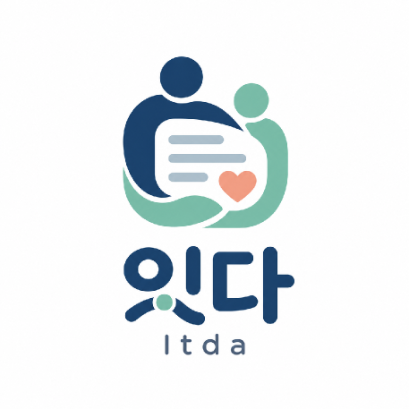
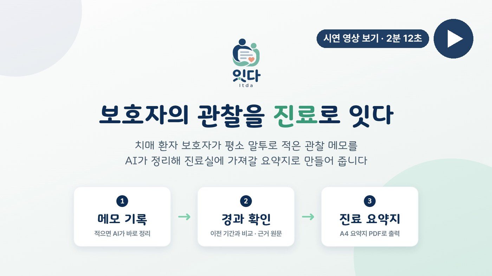
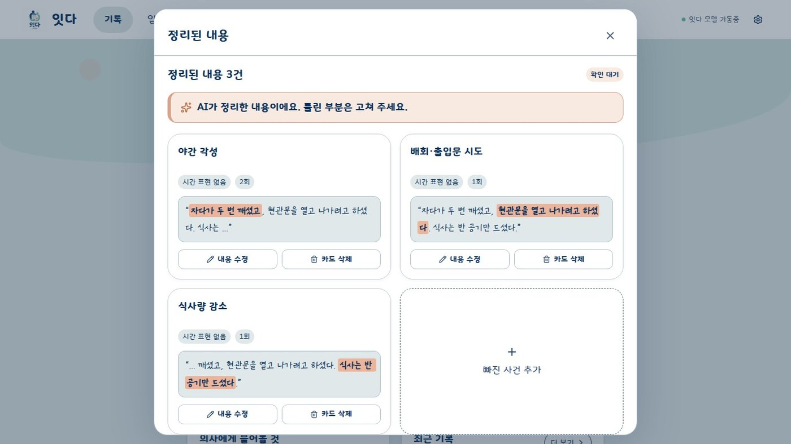
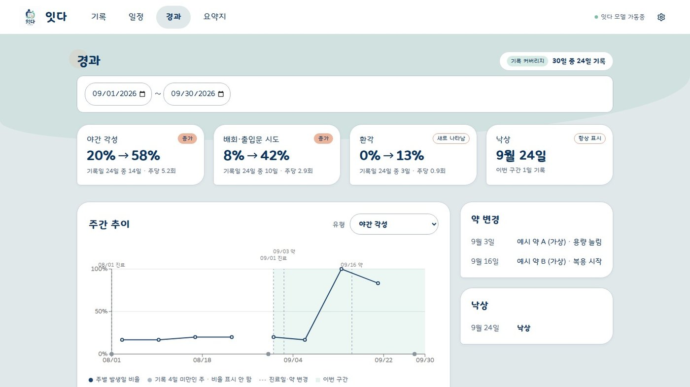
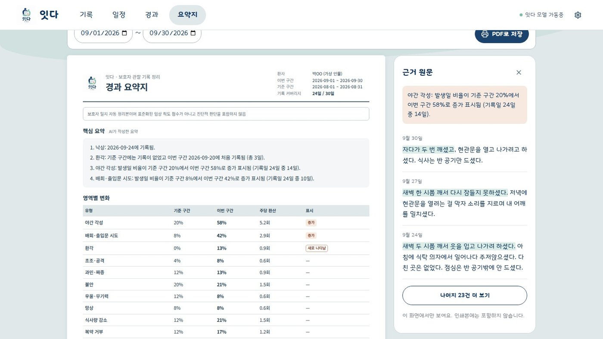
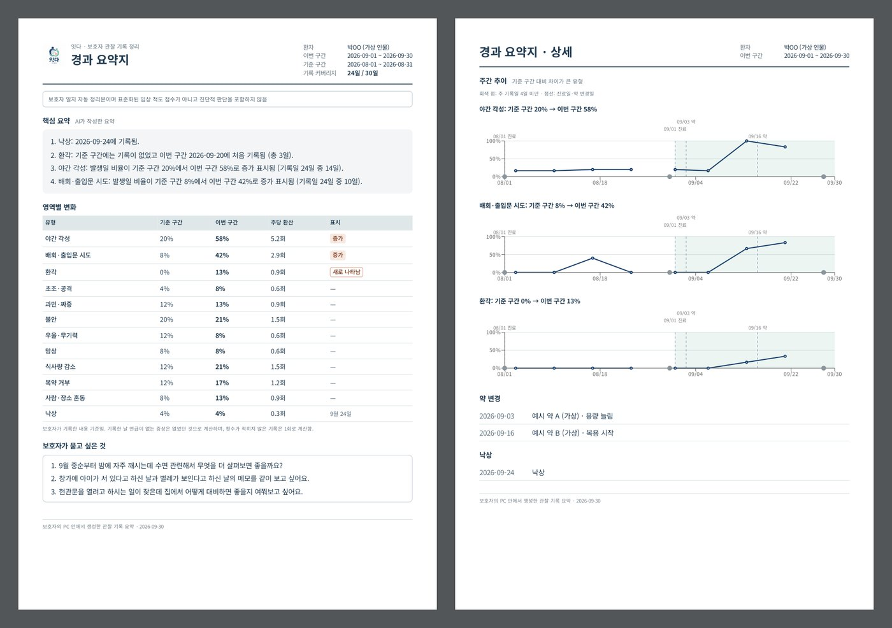
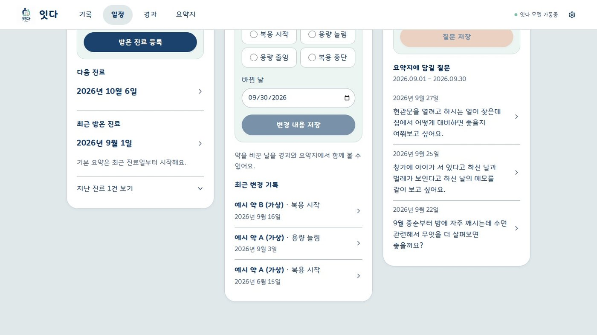
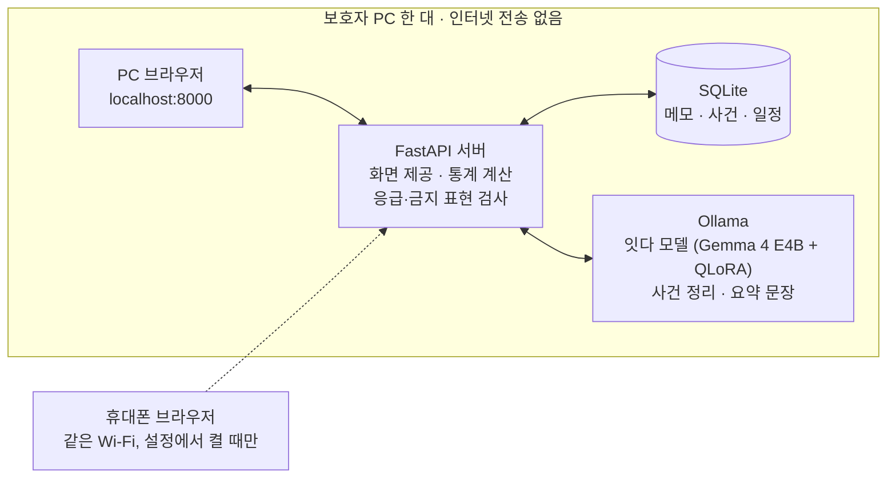

<div align="center">



# 잇다 (Itda)

**보호자의 말을 의사의 언어로, 기기 밖으로 내보내지 않고**

치매 환자 보호자가 말하듯 쓴 관찰 메모를 PC 안의 AI가 증상 기록으로 정리하고,<br>
진료실에 가져갈 A4 요약지로 만들어 주는 서비스


</div>

## 시연 영상

[](https://drive.google.com/file/d/1-lVVVcLBXhm9VTV219TXaRlNyY2ujBOM/view?usp=sharing)

발표 자료: [잇다_최종발표.pptx](docs/잇다_최종발표.pptx)

## 왜 만들었나

> 의사 "요즘 어떠셨어요?"<br>
> 보호자 "좀… 나빠지신 것 같아요"

몇 번, 언제부터, 약을 바꾼 뒤 어땠는지는 보호자의 기억 속에 흩어집니다. 진료 시간은 짧고, 매일의 관찰을 정리해 갈 여유는 없습니다.

- 치매 진료에서 쓰는 NPI·CDR 같은 평가는 **보호자 면담**으로 판정합니다. 보호자의 관찰이 곧 진료의 재료입니다.
- 국내 치매 환자는 2026년 약 100만 명(추계), 돌봄 부담을 느끼는 지역사회 환자 가족은 45.8%입니다.<sup>1</sup>
- 돌봄 기록은 민감한 건강 정보라 외부 서버로 보내기 어렵습니다.

그래서 **말하듯 쓴 메모를 진료에 쓸 정보로, 인터넷 전송 없이 PC 안에서** 바꾸는 것을 목표로 했습니다.

<sub>1. 보건복지부 「2023년 치매역학조사 및 실태조사」(2025.3)</sub>

## 핵심 기능

| | |
|:---:|:---:|
|  |  |
| **① 기록** 평소 말투로 메모를 쓰면 AI가 증상을 찾아 카드로 정리합니다. 카드마다 근거 문장을 표시하고, 보호자가 **확인 완료**를 눌러야 기록이 통계에 들어갑니다. | **② 경과** 증상별 발생 비율을 이전 기간과 비교하고, 통계적으로 늘었거나 새로 나타난 증상을 표시합니다. 숫자마다 근거 메모를 열어 볼 수 있습니다. |
|  |  |
| **③ 요약지** 핵심 변화 요약, 증상별 변화 표, 보호자 질문을 한 장에 담습니다. 문장이나 표의 항목을 누르면 근거 메모가 옆에 뜹니다. | **④ PDF 출력** 아직 확인하지 않은 기록은 출력 전에 알려 주고, 확인된 기록만으로 A4 요약지를 만듭니다. |

<details>
<summary><b>일정 화면</b> — 진료일·약을 바꾼 날·의사에게 물어볼 질문</summary>
<br>


진료일과 약을 바꾼 날은 경과 그래프에 점선으로 표시되고, 질문은 다음 요약지에 함께 들어갑니다.
</details>

## 동작 구조

설치 파일 하나로 보호자 PC 한 대에서 모두 실행됩니다. 메모와 모델 모두 PC 밖으로 나가지 않습니다.



### 설계 원칙

| 숫자는 코드가 | 문장은 모델이 | 코드가 모델을 검사 |
|---|---|---|
| 비율·증가 표시는 규칙으로 계산 | 계산된 사실만 받아 요약 문장 작성 | 사실에 없는 숫자·뒤바뀐 표시·금지 표현이 있으면 정해진 문장 틀로 대체 |

- **확인한 사건만 집계**: 모델이 잘못 뽑은 사건이 통계로 번지지 않습니다.
- **금지 표현 검사**: 진단·원인 해석·약물 권고·안심 판정 같은 의료 판단 문장을 막습니다.
- **응급 키워드 안내**: 모델 호출 전에 메모를 검사해 119·112 안내를 띄웁니다.
- **AI 실패는 오류가 아님**: 원문을 먼저 저장하고, 정리에 실패하면 보호자가 직접 정리할 수 있습니다.

## AI 모델

메모 한 편을 **12개 증상 유형**의 사건 JSON으로 바꾸는 추출 모델입니다. 근거 구절은 원문을 고치지 않고 그대로 복사해, 보호자가 카드에서 바로 대조할 수 있습니다.

```
입력  "어젯밤 두 시쯤 깨셔서 한참 거실 왔다갔다 하심. 저녁 약은 안 드신다고 버티심."
출력  야간 각성 "두 시쯤 깨셔서" · 배회·출입문 시도 "한참 거실 왔다갔다" · 복약 거부 "저녁 약은 안 드신다고"
```

| 단계 | 내용 |
|---|---|
| 데이터 | 실제 메모는 개인정보라 **합성 데이터**를 사용했습니다. 정답(사건 목록)을 먼저 정하고 Claude가 문장으로 풀게 해 라벨 오류를 구조적으로 줄였고, 근거가 원문에 그대로 있는지 자동 검수한 뒤 사람이 다시 확인했습니다. |
| 규모 | 보호자 문체 13종, 학습 1,977 / 검증 200 / 평가 300건입니다. **평가 문체는 학습에 쓰지 않았고**, "뽑지 말아야 할 것"(반복 질문·실금·양만 적힌 식사)도 20% 섞었습니다. |
| 모델 선택 | 4B급 이하 후보를 같은 데이터·조건으로 비교 → **Gemma 4 E4B** (F1 0.986, Qwen 0.972, Gemma 3 4B 0.964, EXAONE 1.2B 0.963) |
| 학습 | QLoRA, GPU 한 장(12GB), 2에폭, JSON 답 부분만 학습 |
| 서빙 | GGUF Q4_K_M(8.0GB → 5.3GB, F1 차이 0.003), Ollama로 PC 안에서 실행, JSON 스키마 강제 |

### 평가 (학습에 쓰지 않은 300건)

| 지표 | 베이스 | 파인튜닝 |
|---|---:|---:|
| 사건 추출 F1 | 0.857 | **0.986** |
| 메모 완전일치 | 65% | **95%** |
| JSON 형식 통과 | — | **300 / 300** |
| CPU만으로 메모 1건 처리 (노트북 Ryzen 7 8845HS) | — | 평균 **7.75초** · 최대 20.45초 (목표 30초) |
| 기존 능력 (일반 질문 30 + KMMLU 50) | 70.0% | 68.8% (**−1.2%p**, 허용 3%p 이내) |
| 블라인드 비교 선택률 (GPT Judge / 팀원 4명) | — | **78% / 75%** |

베이스에서 약했던 과민·짜증(0.74 → 0.99), 사람·장소 혼동(0.79 → 0.99)이 가장 크게 올랐습니다. 데이터 생성, 학습 설정, 평가 상세는 [`ai/README.md`](ai/README.md)에 있습니다.

## 기술적으로 고민한 점

- **스키마 강제와 필드 순서**: Ollama에 JSON 스키마를 강제하면 Qwen·EXAONE은 필드가 알파벳순으로 재배열돼 학습 순서와 달라지고 성능이 떨어졌습니다. Gemma 계열은 순서를 유지해 모델 선택의 결정적 근거가 됐습니다.
- **학습과 같은 프롬프트 보장**: Modelfile을 손으로 쓰지 않고 GGUF에 든 채팅 템플릿에서 생성해, 학습 때와 서빙 때 프롬프트가 같도록 했습니다.
- **"증가" 표시의 통계 기준**: 이번 기간 비율이 `p + 3·√(p(1−p)/n)`(p: 이전 기간 비율, n: 이번 기간 기록일)을 넘을 때만 표시합니다. 부동소수점 반올림 때문에 경계값이 잘못 판정되는 문제를 찾아 분수로 정확히 비교하도록 고쳤습니다.
- **AI 대기 중 서버 멈춤**: 정리를 기다리는 요청이 DB 연결을 쥐고 있어 동시 저장이 몰리면 연결 풀이 바닥나 서버 전체가 멈췄습니다. AI 호출 중에는 연결을 잡지 않고 풀을 쓰지 않도록(NullPool) 바꿨고, 창을 닫아도 정리는 끝까지 수행돼 저장됩니다.
- **경계값 방어**: 범위 밖 ID, 미래 기준일처럼 500 오류를 내던 입력을 찾아 422로 막았습니다.

## 기술 스택

| 영역 | 사용 기술 |
|---|---|
| AI | Gemma 4 E4B, Unsloth(QLoRA), llama.cpp(GGUF 양자화), Ollama, Weights & Biases |
| Backend | Python 3.12, FastAPI, SQLAlchemy, SQLite, Pydantic, uv, pytest, Ruff |
| Frontend | React 19, TypeScript, Vite, Recharts, Lucide, Vitest, Testing Library, Oxlint |
| 테스트 | 백엔드 245개 · 프론트엔드 522개 자동 테스트 |

## 폴더 구조

| 폴더 | 내용 |
| --- | --- |
| [`ai/`](ai/) | 합성 데이터 생성, QLoRA 학습, GGUF 변환, 모델 평가 |
| [`backend/`](backend/) | FastAPI 서버: 메모 저장·AI 정리, 일정, 경과·요약지 계산 (API 24개) |
| [`frontend/`](frontend/) | React 앱: 기록·일정·경과·요약지 화면, A4 인쇄 |
| [`eval/`](eval/) | 서비스 모델 학습·GGUF 변환·정확도 평가 스크립트와 결과 |
| [`verify/`](verify/) | 통계 규칙과 프론트·백엔드 응답 형식을 대조하는 검증 스크립트 |
| [`qa/`](qa/) | API·E2E 점검, 시연 영상 녹화·렌더링 스크립트 |

## 실행

필요한 것: Python 3.12 + [uv](https://docs.astral.sh/uv/), Node.js 24 + pnpm, [Ollama](https://ollama.com/)

```bash
# 화면만 둘러보기 (백엔드·AI 없이 샘플 데이터)
cd frontend && pnpm install && pnpm dev:mock          # http://127.0.0.1:5173

# 전체 실행 (데모 데이터)
cd frontend && pnpm install && pnpm build && cp -r dist ../backend/static
cd ../backend && uv sync
ITDA_DB=demo.db uv run python -m app.demo load
ITDA_DB=demo.db uv run python -m app                   # http://127.0.0.1:8000
```

학습한 모델 파일(GGUF 5.3GB)은 레포에 포함하지 않습니다. 다른 Ollama 모델로 시험하려면 `ITDA_MODEL=<모델 이름>`을 지정합니다. 자세한 설정은 각 폴더의 README에 있습니다.

## 팀 오나주

| 이름 | 역할 |
|---|---|
| 이주영 (팀장) | AI · Frontend |
| 김우진 | 기획 · AI |
| 변은아 | 기획 · AI · Backend |
| 최태순 | AI · Backend |
| 조성률 | AI · Frontend |

AI 모델의 데이터 생성·검수와 평가는 5명이 문체를 나눠 함께 진행했습니다.

### 맡은 일 (최태순)

- **백엔드 설계·구현**: ERD·API 명세 작성, FastAPI 서버(기록·일정·경과·요약지), 증가 표시 통계, 동시성·경계값 오류 수정과 시나리오 테스트
- **학습 데이터**: 문체 2종(40대 아들 직장인, 40대 며느리) 메모 생성·검수
- **검증**: 통계 규칙과 프론트·백엔드 응답 형식 대조, API·E2E 점검

---

<sub>팀 저장소 [OHNAJOO/itda-ai](https://github.com/OHNAJOO/itda-ai) · [itda-backend](https://github.com/OHNAJOO/itda-backend) · [itda-frontend](https://github.com/OHNAJOO/itda-frontend)의 커밋 기록을 그대로 합친 개인 저장소입니다.</sub>
